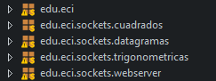

#  Clientes y Servicios en Java

En este proyecto se desarrolaron 4 temas diferentes los cuales fueron:
  - Trabajando con URLs
  - Sockets (enchufes)
  - Servidor web
  - Datagramas

## Empezando

Para ejecutar el programa debe ingresar al codigo fuente y revisar cada pauete el cual especifica cada punto realizado

### Pre-requisitos

Solo se debe tener instalado java 

## Probando

Para probar cada uno de los ejercicios solo se debe  correr las clases main  creadas en cada uno de los paquetes
- 
Dando como resultado exito de cada uno de los puntos podemos ver a continuacion el resultado de cada ejercicio.
### Exercise 1
In the firt exercise i create a program when i learn about the URL and your componets , in the out of this exercise i get the results present below :
`protocol = http
authority = url.com:80
host = url.com
port = 80
path = /tutorial/index.html
query = name=URL
filename = /tutorial/index.html?name=URL
ref = PRUEBA`
### Exercise 2
In this exercise i create a program that copy the html from a web page and i put this code in a file.html and them i open this file with any browser, then i can see the pages who had copy.
  - 
### Exercise 3
In this exercise i create a client-server and i connected them, then the client have a request to the server and he returns a square number.
  - 
### Exercise 4
In this exercise i create another a client-server but in this case the server return a trigonometric funtion (cos,sen,tan), this server need that i put the operand one time and  the all numbers he resolve it using this operand  when i change the operand and he has no problems to resolve it. 
  - 
  
### Exercise 5
Here i add the code  given in the lab and i add  these commands for the server show the html in te browser `out.println("HTTP/1.1 200 OK"); out.println("Content-Type: text/html"); out.println("\r\n");` 
and then the server show your content.
  - 
  - 
### Exercise 6 
In this exercise i create a http server that recibe multiples request and return all files 
  - 
  - 
### Exercise 7
In this exercise i implements a datagrams unis threads and i implements a client-server that reponds the actual time and the program update every five minutes.
  - 

## Autor

* **Javier Vargas** - *ECI*

## License

Este proyecto está licenciado bajo GNU  License v3.0 - ver [LICENSE](LICENSE) para más detalles.

